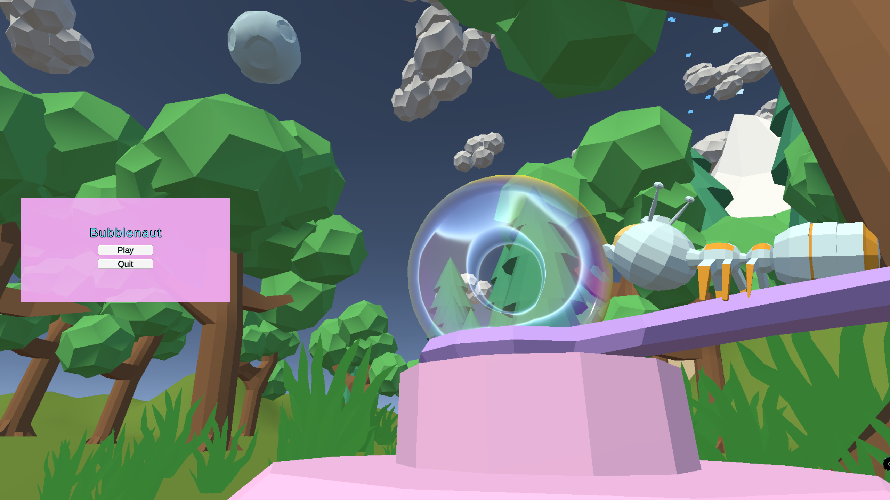
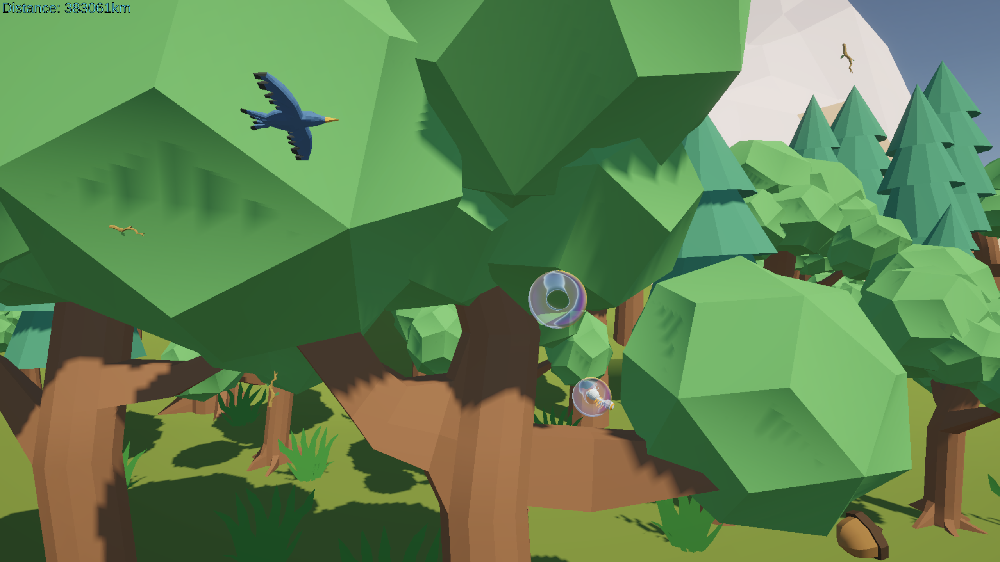
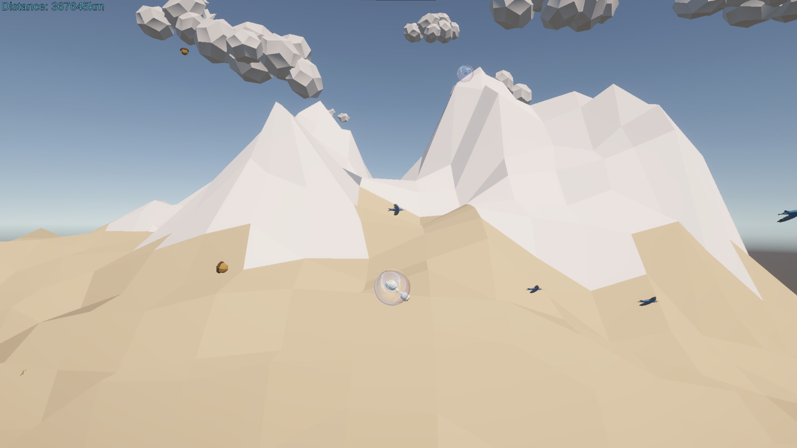

# Bubblenaut
Game created for Vancouver Global Game Jam 2025

BubbleNaut is a 2.5D vertical climber where you play as a tiny yet hugely ambitious ant determined to reach the moon—using nothing but a fragile bubble. Dodge falling debris, collect bubbles to gain altitude faster, and float to the rhythm of chill lo-fi beats. Will you guide BubbleNaut to his dream, or will he plummet back to Earth?

[Play Bubblenaut here!](https://benniekhademgames.itch.io/bubblenautgame)

## Screenshots

Title Screen

    

Gameplay

    

    

